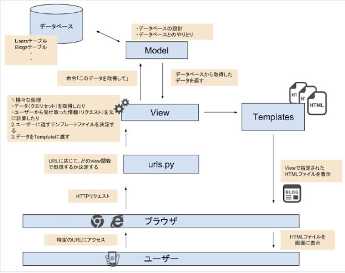
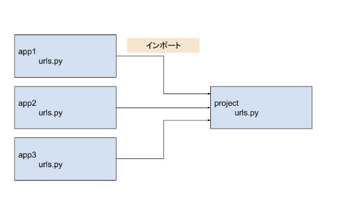

# DjangoBrothers

## プロジェクトとアプリケーションの作成
* プロジェクトの作成には以下のコマンドを実行する.
	```zsh
	django-admin startproject [project_name]
	```
* プロジェクトでデータベースを使用する場合は、以下のコマンドでデータベースを作成する.
	```zsh
	python manage.py migrate
	```
* アプリケーションの作成には以下のコマンドを実行する.
	```zsh
	python manage.py startapp [app_name]
	```
* 作成したアプリケーションは、`project_name/project_name/settings.py`の`INSTALLED_APPS`に登録する必要がある.
	```python
	# prject_name/project_name/settings.py
	INSTALLED_APPS = [
		"app_name",
	]
	```
<br />

## URLの設定
* ユーザがURLを打ち込んだ時に表示されるファイルを設定するには、以下の手順で行う.
	1. アプリケーション自体をプロジェクトのURLに紐付ける. `project_name/project_name/urls.py`に以下のコードを記述する.
		```python
		# project_name/project_name/urls.py
		from django.contrib import admin
		from django.urls import include, path


		urlpatterns = [
			path('admin/', admin.site.urls),
			path('app_name', include("app_name.urls")),
		]
		```
		* これは、`http://127.0.0.1:8000/app_name/`にアクセスされた時に、`app_name.urls`（`project_name/app_name/urls.py`）を参照することを意味している.
	2. アプリケーションディレクトリに`urls.py`を作成する. `project_name/app_name/urls.py`ファイルを作成して以下のコードを記述する.
		```python
		from django.urls import path
		
		from . import views


		app_name = 'app_name'
		urlpatterns = [
			path('', views.index, name="index"),
		]
		```
		* これは、`project_name/app_name/views.py`をインポートし、`index`関数を実行することを意味する.
<br />

## レンダリングの流れ

<br />

## データベースの作成
* 新たにテーブルを作成する場合は、`モデル`を使用する.
* `モデル`とは、データベースとやりとりするクラスのことである.
* 1つの`モデル`に対して1つのデータベーステーブルが割り当てられる.
* `モデル`は、`project_name/app_name/models.py`に記述する.
	```python
	# 例: `django_blog/blogs/models.py
	from django.db import models


	class Blog(models.Model):
		title            = models.CharField(blank=False, null=False, max_length=150)
		text             = models.TextField(blank=True)
		created_datetime = models.DateTimeField(auto_now_add=True)
		updated_datetime = models.DateTimeField(auto_now=True)


		def __str__(self):
			return self.title
	```
	* `モデル`のクラス名は **単数形** で書く. これにより複数形の名称のテーブルが自動生成される.
	* `blank=False`、`null=False`は、フィールドの空欄を許容しないことを示す. `blank`と`null`の違いは、入力フォームでの空欄を許容するか、データベース上での空欄を許容するかどうかの違いである.
	* `auto_now_add=True`、`auto_now=True`は、インスタンスが作成された日時、更新された日時を自動的に保存できるように設定する.
	* `def __str__(self)`は、管理ページ（http://127.0.0.1:8000/admin/）などで各インスタンスを表示する時に表示するものを記述している.
* `モデル`はあくまでもデータベースの設計図であるため、`モデル`をもとに実際にデータベースを作成するには **マイグレート** する必要がある. **マイグレート** とは、`project_name/app_name/models.py`で定義したデータベースの設計を実際にデータベースに反映させることである. **マイグレート** するには以下の2つのコマンドを実行する. `project_name/app_name/models.py`に変更を加えた時は、その都度マイグレート処理（以下2つのコマンドの実行）をする必要がある.
	```zsh
	python manage.py makemigrations
	python manage.py migrate
	```
	* `python manage.py makemigrations`は、**マイグレーションファイル** を作成するためのコマンドである. **マイグレーションファイル** は、`project_name/app_name/models.py`で作成したデータベースの設計情報がまとめられたファイルである. このコマンドにより、`project_name/app_name/migrations/`のなkにマイグレーションファイルが新たに追加される.
	* `python manage.py migrate`は、**マイグレーションファイル** の情報をデータベースに反映させるためのコマンドである.
<br />

## Adminページの利用
* Adminページを利用する前にスーパユーザアカウントを作成する必要がある. スーパユーザアカウントを作成するには以下のコマンドを実行する.
	```zsh
	python manage.py createsuperuser
	```
* `モデル`をAdminページから利用できるようにするには、`project_name/app_name/admin.py`に以下のようにコードを記述する.
	```python
	#django_blog/blogs/admin.py
	from django.contrib import admin
	from .models import Blog


	admin.site.register(Blog)
	```
* Adminページの`モデル`の表示などをカスタマイズするには、`project_name/app_name/admin.py`に以下のようにコードを記述する.
	```python
	#django_blog/blogs/admin.py
	from django.contrib import admin
	from .models import Blog


	class BlogAdmin(admin.ModelAdmin):
		list_display = ("id", "created_datetime", "updated_datetime")
		list_display_links = ("id", "title")
	


	admin.site.register(Blog, BlogAdmin)
	```
<br />

## クエリセット
* Djangoでは、`model.objects`とコードを書くことで、データベースにアクセスすることができる.
* `objects`は、様々なメソッドを持っており、メソッドを使用することで指定した条件でデータを取得することができる. 取得したデータのリストのことを **クエリセット（Query Set）** と呼ぶ.
* メソッド例
	* `model.objects.all()`
		* データベースに保存されているすべてのインスタンスを取得する.
	* `model.objects.get()`
		* 条件に合う1つのインスタンスを取得する.
	* `model.objects.filter()`
		* 条件に合うすべてのインスタンスを取得する.
	* `model.objects.order_by()`
		* 指定したフィールドを基準にして昇順で取得する.
		* 降順に取得するには、フィールドの前に`-`を付ける.
	* `model.objects.create()`
		* インスタンスを作成する.
<br />

## テンプレートタグ
* `project_name/app_name/views.py`の`render()`にテンプレート（HTML）に渡したいデータを指定することができる. `View`から渡されたデータは、キーに指定した文字列をテンプレート側で`{{}}`で囲むことで表示することができる. `{{}}`のことを **テンプレートタグ** と呼ぶ.
	* View
		```python
		# django_blog/blogs/views.py
		from django.shortcuts import render

		from .models import Blog


		def index(request):
			blogs = Blog.objects.order_by('created_datetime')
			return render(request, 'blogs/index.html', {'blogs': blogs})
		```
	* テンプレート（HTML）
		```html
		<h1>ブログサイト</h1>
		<p>ここはトップページです。</p>
		{{ blogs }}
		```
<br />

## 画像
* [Django画像を表示・アップロードする方法を実例付きで解説](https://itc.tokyo/django/setup-media-root/)
* [ImageFieldの使い方 開発環境編](https://self-methods.com/django-imagefield-basic/)
* [Djangoで画像を表示する方法](https://intellectual-curiosity.tokyo/2019/03/08/django%E3%81%A7%E7%94%BB%E5%83%8F%E3%82%92%E8%A1%A8%E7%A4%BA%E3%81%99%E3%82%8B%E6%96%B9%E6%B3%95/)
<br />

## Djangoの基礎

<br />

## MTV
* Djangoプロジェクトは、`Model`、`Templates`、`View`によって構成され、`MTV`構成と呼ぶ.
* 新たにページを作成する時には、以下の3つの作業が必要となる.
	1. URL設定（`urls.py`）
	2. View設定（`views.py`）
	3. Template設定（`html`）
* MTVのイメージ図
	
* URL設定
	* URLは、プロジェクトディレクトリ（`project_name/project_name/`）内の`urls.py`で定義する. 通常は、アプリディレクトリ（`project_name/app_name/`）内に`urls.py`を作成して、それをインポートする.
		
* View設定
	* `View`は、アプリディレクトリ（`project_name/app_name/`）内の`views.py`で定義する.
* Template設定
	* `Template`は、アプリディレクトリ（`project_name/app_name/`）内に`templates`ディレクトリを作成し、その中にHTMLファイルを作成する（`project_name/app_name/templates/app_name/xxx.html`）.
	* `templates`ディレクトリにもう一つディレクトリを作成する理由
		* `views.py`の`render()`の第2引数では表示するテンプレートファイルを指定するが、Djangoのデフォルト設定ではアプリ内の`templates`ディレクトリを自動で参照する. したがって、第2引数に`app_name/xxx.html`を指定することで`project_name/app_name/templates/app_name/xxx.html`を指定していることになる.
		* フォルダ構成を`project_name/app_name/templates/xxx.html`のように`templates`ディレクトリ直下にHTMLファイルを作成し、`views.py`の`render()`の第2引数に`xxx.html`を指定するという書き方もできる. しかし、この書き方だとapp1とapp2のように複数のアプリが存在し、それぞれが`index.html`という同名のファイルを保有している場合、`render(request, "index.html")`とすると、`render()`は常にapp1内の`templates`ディレクトリを参照してしまい、app2内の`index.html`は指定できなくなってしまう. 仮にapp2の中にある`views.py`で`render(request, "index.html")`と記述してもapp1の`index.html`を参照する. これは、テンプレートファイルを参照するときに、上のtemplatesディレクトリから探していくという決まりがあるからである.
		* app内の`templates`ディレクトリを自動的に参照するのは、`project_name/project_name/settings.py`の`APP_DIRS`がTrueになっているからである.
			```python
			TEMPLATES = [
    			{
        			'BACKEND': 'django.template.backends.django.DjangoTemplates',
        			'DIRS': [],
        			'APP_DIRS': True,
        			'OPTIONS': {
            			'context_processors': [
                			'django.template.context_processors.debug',
                			'django.template.context_processors.request',
                			'django.contrib.auth.context_processors.auth',
                			'django.contrib.messages.context_processors.messages',
            			],
        			},
    			},
			]
			```
<br />

## 404
* `get_object_or_404()`
	* `variable = Model.objects.get(id=id)`のように`get`メソッドを使用してインスタンスを取得できるが、`id`が存在しなかった場合エラーとなってしまう.
	* `get_object_or_404()`は、存在しない`id`が指定された場合404ページを表示する.
* [404ページのカスタマイズ](https://djangobrothers.com/blogs/django_404_page/)
	* デフォルトの404ページは編集も可能である.
<br />

## 参照
* [DjangoBrothers](https://djangobrothers.com/)