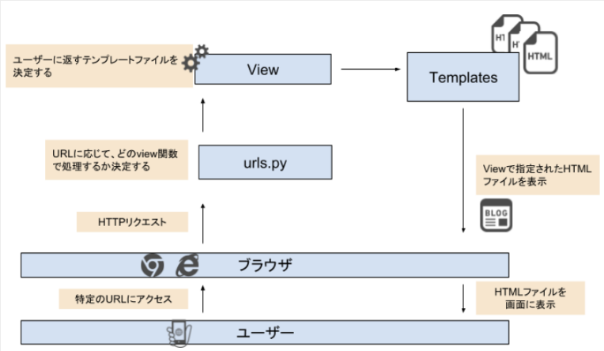

# DjangoBrothers

## プロジェクトとアプリケーションの作成
* プロジェクトの作成には以下のコマンドを実行する.
	```zsh
	django-admin startproject [project_name]
	```
* プロジェクトでデータベースを使用する場合は、以下のコマンドでデータベースを作成する.
	```zsh
	python manage.py migrate
	```
* アプリケーションの作成には以下のコマンドを実行する.
	```zsh
	python manage.py startapp [app_name]
	```
* 作成したアプリケーションは、`project_name/project_name/settings.py`の`INSTALLED_APPS`に登録する必要がある.
	```python
	# prject_name/project_name/settings.py
	INSTALLED_APPS = [
		"app_name",
	]
	```
<br />

## URLの設定
* ユーザがURLを打ち込んだ時に表示されるファイルを設定するには、以下の手順で行う.
	1. アプリケーション自体をプロジェクトのURLに紐付ける. `project_name/project_name/urls.py`に以下のコードを記述する.
		```python
		# project_name/project_name/urls.py
		from django.contrib import admin
		from django.urls import include, path


		urlpatterns = [
			path('admin/', admin.site.urls),
			path('app_name', include("app_name.urls")),
		]
		```
		* これは、`http://127.0.0.1:8000/app_name/`にアクセスされた時に、`app_name.urls`（`project_name/app_name/urls.py`）を参照することを意味している.
	2. アプリケーションディレクトリに`urls.py`を作成する. `project_name/app_name/urls.py`ファイルを作成して以下のコードを記述する.
		```python
		from django.urls import path
		
		from . import views


		app_name = 'app_name'
		urlpatterns = [
			path('', views.index, name="index"),
		]
		```
		* これは、`project_name/app_name/views.py`をインポートし、`index`関数を実行することを意味する.
<br />

## レンダリングの流れ

<br />

## データベースの作成
* 新たにテーブルを作成する場合は、`モデル`を使用する.
* `モデル`とは、データベースとやりとりするクラスのことである.
* 1つの`モデル`に対して1つのデータベーステーブルが割り当てられる.
* `モデル`は、`project_name/app_name/models.py`に記述する.
	```python
	# 例: `django_blog/blogs/models.py
	from django.db import models


	class Blog(models.Model):
		title            = models.CharField(blank=False, null=False, max_length=150)
		text             = models.TextField(blank=True)
		created_datetime = models.DateTimeField(auto_now_add=True)
		updated_datetime = models.DateTimeField(auto_now=True)


		def __str__(self):
			return self.title
	```
	* `モデル`のクラス名は **単数形** で書く. これにより複数形の名称のテーブルが自動生成される.
	* `blank=False`、`null=False`は、フィールドの空欄を許容しないことを示す. `blank`と`null`の違いは、入力フォームでの空欄を許容するか、データベース上での空欄を許容するかどうかの違いである.
	* `auto_now_add=True`、`auto_now=True`は、インスタンスが作成された日時、更新された日時を自動的に保存できるように設定する.
	* `def __str__(self)`は、管理ページ（http://127.0.0.1:8000/admin/）などで各インスタンスを表示する時に表示するものを記述している.
* `モデル`はあくまでもデータベースの設計図であるため、`モデル`をもとに実際にデータベースを作成するには **マイグレート** する必要がある. **マイグレート** とは、`project_name/app_name/models.py`で定義したデータベースの設計を実際にデータベースに反映させることである. **マイグレート** するには以下の2つのコマンドを実行する. `project_name/app_name/models.py`に変更を加えた時は、その都度マイグレート処理（以下2つのコマンドの実行）をする必要がある.
	```zsh
	python manage.py makemigrations
	python manage.py migrate
	```
	* `python manage.py makemigrations`は、**マイグレーションファイル** を作成するためのコマンドである. **マイグレーションファイル** は、`project_name/app_name/models.py`で作成したデータベースの設計情報がまとめられたファイルである. このコマンドにより、`project_name/app_name/migrations/`のなkにマイグレーションファイルが新たに追加される.
	* `python manage.py migrate`は、**マイグレーションファイル** の情報をデータベースに反映させるためのコマンドである.
<br />

## Adminページの利用
* Adminページを利用する前にスーパユーザアカウントを作成する必要がある. スーパユーザアカウントを作成するには以下のコマンドを実行する.
	```zsh
	python manage.py createsuperuser
	```
* `モデル`をAdminページから利用できるようにするには、`project_name/app_name/admin.py`に以下のようにコードを記述する.
	```python
	#django_blog/blogs/admin.py
	from django.contrib import admin
	from .models import Blog


	admin.site.register(Blog)
	```
* Adminページの`モデル`の表示などをカスタマイズするには、`project_name/app_name/admin.py`に以下のようにコードを記述する.
	```python
	#django_blog/blogs/admin.py
	from django.contrib import admin
	from .models import Blog


	class BlogAdmin(admin.ModelAdmin):
		list_display = ("id", "created_datetime", "updated_datetime")
		list_display_links = ("id", "title")
	


	admin.site.register(Blog, BlogAdmin)
	```
<br />

## クエリセット
* Djangoでは、`model.objects`とコードを書くことで、データベースにアクセスすることができる.
* `objects`は、様々なメソッドを持っており、メソッドを使用することで指定した条件でデータを取得することができる. 取得したデータのリストのことを **クエリセット（Query Set）** と呼ぶ.
* メソッド例
	* `model.objects.all()`
		* データベースに保存されているすべてのインスタンスを取得する.
	* `model.objects.get()`
		* 条件に合う1つのインスタンスを取得する.
	* `model.objects.filter()`
		* 条件に合うすべてのインスタンスを取得する.
	* `model.objects.order_by()`
		* 指定したフィールドを基準にして昇順で取得する.
		* 降順に取得するには、フィールドの前に`-`を付ける.
	* `model.objects.create()`
		* インスタンスを作成する.
<br />

## テンプレートタグ
* `project_name/app_name/views.py`の`render()`にテンプレート（HTML）に渡したいデータを指定することができる. `View`から渡されたデータは、キーに指定した文字列をテンプレート側で`{{}}`で囲むことで表示することができる. `{{}}`のことを **テンプレートタグ** と呼ぶ.
	* View
		```python
		# django_blog/blogs/views.py
		from django.shortcuts import render

		from .models import Blog


		def index(request):
			blogs = Blog.objects.order_by('created_datetime')
			return render(request, 'blogs/index.html', {'blogs': blogs})
		```
	* テンプレート（HTML）
		```html
		<h1>ブログサイト</h1>
		<p>ここはトップページです。</p>
		{{ blogs }}
		```
<br />

## 画像
* [Django画像を表示・アップロードする方法を実例付きで解説](https://itc.tokyo/django/setup-media-root/)
* [ImageFieldの使い方 開発環境編](https://self-methods.com/django-imagefield-basic/)
* [Djangoで画像を表示する方法](https://intellectual-curiosity.tokyo/2019/03/08/django%E3%81%A7%E7%94%BB%E5%83%8F%E3%82%92%E8%A1%A8%E7%A4%BA%E3%81%99%E3%82%8B%E6%96%B9%E6%B3%95/)
<br />

## Djangoの基礎

<br />

## MTV
* Djangoプロジェクトは、`Model`、`Templates`、`View`によって構成され、`MTV`構成と呼ぶ.
* 新たにページを作成する時には、以下の3つの作業が必要となる.
	1. URL設定（`urls.py`）
	2. View設定（`views.py`）
	3. Template設定（`html`）
* MTVのイメージ図
	
* URL設定
	* URLは、プロジェクトディレクトリ（`project_name/project_name/`）内の`urls.py`で定義する. 通常は、アプリディレクトリ（`project_name/app_name/`）内に`urls.py`を作成して、それをインポートする.
		
* View設定
	* `View`は、アプリディレクトリ（`project_name/app_name/`）内の`views.py`で定義する.
* Template設定
	* `Template`は、アプリディレクトリ（`project_name/app_name/`）内に`templates`ディレクトリを作成し、その中にHTMLファイルを作成する（`project_name/app_name/templates/app_name/xxx.html`）.
	* `templates`ディレクトリにもう一つディレクトリを作成する理由
		* `views.py`の`render()`の第2引数では表示するテンプレートファイルを指定するが、Djangoのデフォルト設定ではアプリ内の`templates`ディレクトリを自動で参照する. したがって、第2引数に`app_name/xxx.html`を指定することで`project_name/app_name/templates/app_name/xxx.html`を指定していることになる.
		* フォルダ構成を`project_name/app_name/templates/xxx.html`のように`templates`ディレクトリ直下にHTMLファイルを作成し、`views.py`の`render()`の第2引数に`xxx.html`を指定するという書き方もできる. しかし、この書き方だとapp1とapp2のように複数のアプリが存在し、それぞれが`index.html`という同名のファイルを保有している場合、`render(request, "index.html")`とすると、`render()`は常にapp1内の`templates`ディレクトリを参照してしまい、app2内の`index.html`は指定できなくなってしまう. 仮にapp2の中にある`views.py`で`render(request, "index.html")`と記述してもapp1の`index.html`を参照する. これは、テンプレートファイルを参照するときに、上のtemplatesディレクトリから探していくという決まりがあるからである.
		* app内の`templates`ディレクトリを自動的に参照するのは、`project_name/project_name/settings.py`の`APP_DIRS`がTrueになっているからである.
			```python
			TEMPLATES = [
    			{
        			'BACKEND': 'django.template.backends.django.DjangoTemplates',
        			'DIRS': [],
        			'APP_DIRS': True,
        			'OPTIONS': {
            			'context_processors': [
                			'django.template.context_processors.debug',
                			'django.template.context_processors.request',
                			'django.contrib.auth.context_processors.auth',
                			'django.contrib.messages.context_processors.messages',
            			],
        			},
    			},
			]
			```
<br />

## 404
* `get_object_or_404()`
	* `variable = Model.objects.get(id=id)`のように`get`メソッドを使用してインスタンスを取得できるが、`id`が存在しなかった場合エラーとなってしまう.
	* `get_object_or_404()`は、存在しない`id`が指定された場合404ページを表示する.
* [404ページのカスタマイズ](https://djangobrothers.com/blogs/django_404_page/)
	* デフォルトの404ページは編集も可能である.
<br />

## CRUD
* CRUDは、Create、Read、Update、Deleteの4つの単語の頭文字からなる言葉であり、ソフトウェアで頻繁に利用される基本機能を表す.
	
* HTTPメソッド
	* ブラウザとサーバの通信では、HTTPプロトコルが使用されている. これは、**HTTPという方式に従ってブラウザとサーバはやり取りする** ことを意味する.
	* ユーザは、ブラウザ上で特定のURLにアクセスすることによって、サーバに対してHTTPリクエストを送っている. リクエストを受け取ったサーバは、その内容に基づいて情報を返す（HTTPレスポンス）.
	* 例えば、ユーザーが`http://127.0.0.1:8000/1`にアクセスした場合、サーバに対して「`detail.html`を返してくれ」というリクエストが送られる. リクエストを受け取ったサーバーは、URLから`id=1`のメモを返せばいいと判断する. そして、DBから`id=1`のインスタンスを探しだし、その情報を`detail.html`に載せてブラウザに返す. このサーバー上の処理を定義しているのがDjangoである. この例の場合、情報を読み取っているのでCRUDのReadに該当する.
	

	* HTTPリクエストの中には様々な情報が含まれているが、その中には`method`という項目が存在する. `method`は、そのリクエストがどのような種類のものであるかを表す. 
	* `GET`は、**サーバからデータを返して欲しい場合** に使用される. ブラウザにURLを直接入力した時や、`a`タグで囲まれたリンクをクリックした時などにサーバに対して`method=GET`のリクエストが送信される.
	* `POST`は、**サーバに対して何かデータを送信したい場合** に使用される. `POST`は、データを送信することによってDBに新しいデータを追加することができる.
	* CRUDのCreateでは、新しい情報をサーバに送信する必要があるので`POST`を使用する.
	
* Create（フォームの作成）
	* `project_name/app_name/forms.py`を作成する.
		```python
		# memo/app/forms.py
		from django forms import ModelForm

		from .models import Memo


		class MemoForm(ModelForm):
			class Meta:
				model = Memo
				fields = ["title", "text"]
		```
		* `ModelForm`は、各々のモデルに対応したフォームを作成してくれる. ここでは、`model=Memo`とすることで`Memo`モデルに対応したフォームを生成している.
		* `fields = ["title", "text"]`とすることで、これらに対応する入力欄があるフォームが作成できる.
	* `views.py`に追加する.
		```python
		# memo/app/views.py
		from .forms import MemoForm


		def new_memo(request):
			form = MemoForm
			return render(request, "app/new_memo.html", {"form": form})
		```
	* フォームを使用するテンプレートを作成する.
		```html
		<div>
			<a href="">ホームに戻る</a>
		</div>

		<form action="" method="POST">
			
			{{ form.as_p }}
			<button type="submit" class="btn">保存</button>
		</form>
		```
		* HTMLの`form`タグで`{{ form }}`を囲むことで`MemoForm`をフォームとして表示する.
		* `.as_p`を付けることで入力欄ごとに`p`タグで囲われることになるので、改行されて綺麗に表示される.
		* `action`の部分では、フォームが投稿された時に実行される処理を定義する. **投稿された時** とは、`type="submit"`のボタンが押された時である.
		* `method=POST`は、`POST`なので、フォームが入力したデータも一緒にサーバに送信される.
		* ``は、CSRF対策に必要なものであり、これが無いとエラーになる.
	* フォームから受け取った情報を保存するように関数を書き換える.
		```python
		# memo/app/views.py
		from django.shortcuts import redirect, render


		def new_memo(request):
			if request.method == "POST":
				form = MemoForm(request.POST)
				if form.is_valid():
					form.save()
					return redirect("app:index")
			else:
				from = MemoForm
			return render(request, "app/new_memo.html", {"form": form})
		```
		* `form.save()`を実行することで、POSTで送信されたデータを保存する.
		* `if form.is_valid()`は、生成されたインスタンスが正しい値を持っているかを検証している. ここでの`Memo`モデルは、`title`が150字より多かったり、`blank`ではいけないなどの条件を`models.py`で指定しているので、インスタンスがこれらの条件を満たしているかを判定している.
	* モデルをベースとしないプレーンなフォームを作成することもできる. お問合せフォームなどのモデルとは関係のないフォームが必要な時はプレーンなフォームを使用する.
* Delete
	* URLを`urls.py`に設定する.
		```python
		# memo/app/urls.py
		from django.urls import path

		from . import views


		app_name = "app"
		urlpatterns = [
			path('', views.index, name="index"),
			path('<int:memo_id>', views.detail, name="detail"),
			path('new_memo', views.new_memo, name="new_memo"),
			# この1行を追加
			path('delete_memo/<int:memo_id>', views.delete_memo, name="delete_memo"),
		]
		```
	* `views.py`に削除する関数を作成する.
		```python
		# memo/app/views.py
		from django.shortcuts import get_object_or_404, redirect
		from django.views.decorators.http import require_POST


		@request_POST
		def delete_memo(request, memo_id):
			memo = get_object_or_404(Memo, id=memo_id)
			memo.delete()
			return redirect("app:index")
		```
		* `@request_POST`は、POSTメソッドの時にのみ削除機能が実行されるようにするためのデコレータである. このデコレータが無い場合、そのURLにアクセスした（GET）時にも削除機能が実行されてしまう.
	* テンプレートを作成する.
		```html
		<div>
			<a href="">ホームに戻る</a>
		</div>

		<h2>{{ memo.title }}</h2>

		<div>
			{{ memo.text | linebreaks | urlize }}
		</div>

		<form method="post" action="">
			
			<button class="btn" type="submit" onclick="return confirm('本当に削除しますか？');">削除</button>
		</form>
		```
* Update
	* URLを`urls.py`に設定する.
		```python
		# memo/app/urls.py
		from django.urls import path

		from . import views


		app_name = "app"
		urlpatterns = [
			path('', views.index, name="index"),
			path('<int:memo_id>', views.detail, name="detail"),
			path('new_memo', views.new_memo, name="new_memo"),
			path('delete_memo/<int:memo_id>', views.delete_memo, name="delete_memo"),
			# この1行を追加
			path('edit_memo/<int:memo_id>', views.edit_memo, name="edit_memo"),
		]
		```
	* `views.py`に編集する関数を作成する.
		```python
		# memo/app/views.py
		from django.shortcuts import get_object_or_404, redirect
		from django.views.decorators.http import require_POST


		def edit_memo(request, memo_id):
			memo = get_object_or_404(Memo, id=memo_id)
			form = MemoForm
			return render(request, "app/edit_memo.html", {"form": form, "memo": memo})
		```
	* テンプレートを作成する.
		```html
		<div>
			<a href="">戻る</a>
		</div>

		<form action="" method="POST">
			
			{{ form.as_p }}
			<button class="btn" type="submit">保存</button>
		</form>
		```
	* `detail.html`に編集画面（`edit_memo.html`）へのリンクを追加する.
		```html
		<div>
			<a href="">ホームに戻る</a>
		</div>

		<h2>{{ memo.title }}</h2>

		<div>
			{{ memo.text | lienbreaks | urlize }}
		</div>

		<button><a class="btn" href="">編集</a></button>

		<form method="post" action="">
			
			<button class="btn" type="submit" onclick="return confirm('本当に削除しますか？');">削除</button>
		</form>
		```
	* 編集時に元のデータがフォームに入っている状態にするために関数を書き換える.
		```python
		# memo/app/views.py
		from django.shortcuts import get_object_or_404, redirect
		from django.views.decorators.http import require_POST


		def edit_memo(request, memo_id):
			memo = get_object_or_404(Memo, id=memo_id)
			form = MemoForm(instance=memo)
			return render(request, "app/edit_memo.html", {"form": form, "memo": memo})
		```
		* `MemoForm`に`instance`という引数を与え、元データである`memo`インスタンスを指定することで、指定したインスタンスに対応したフォームが作成される.
	* フォームから受け取った情報を保存するように関数を書き換える.
		```python
		# memo/app/views.py
		from django.shortcuts import get_object_or_404, redirect
		from django.views.decorators.http import require_POST


		def edit_memo(request, memo_id):
			memo = get_object_or_404(Memo, id=memo_id)
			if request.method == "POST":
				form = MemoForm(request.POST, instance=memo)
				if form.is_valid():
					form.save()
					return redirect("app:index")
			else:
				form = MemoForm(instance=memo)
			return render(request, "app/edit_memo.html", {"form": form, "memo": memo})
		```
<br />

## テンプレートの拡張
* `<header>`や`<footer>`など複数のテンプレートで共通する部分は、`base.html`としてまとめることができる.
	```html
	<!DOCTYPE html>
	<html lang="en">
	<head>
		<meta charset="UTF-8">
		<meta http-equiv="X-UA-Compatible" content="IE=edge">
		<meta name="viewport" content="width=device-width, initial-scale=1.0">
		<title>DjangoBrosMemo</title>
	</head>
	<body>
		<h1>DjangoBrosMemo</h1>

		<div class="container">
			
		</div>
	</body>
	</html>
	```
* 上記の`base.html`を他のテンプレートで利用するには、以下のようにHTMLファイルを記述する.
	```html
	

	

		<a class="btn" href="">新規メモ作成</a>

		
			<a href="" class="memo-title">
				<div>
					{{ memo }}
					<span class="updated_datetime">{{ memo.updated_datetime }}</span>
				</div>
			</a>
		
	
	
	```
	* ``で、`base.html`を拡張することを示す.
	* ``と``で囲まれた部分が、`base.html`の``と``の中に取り込まれた形で表示される.
<br />

## CSSファイルの適用
* `project_name/app_name/static/app_name/css/style.css`としてCSSファイルを作成する.
* CSSを使用するHTMLファイルに以下のように記述する.
	```html
	

	<!DOCTYPE html>
	<html lang="en">
	<head>
		<meta charset="UTF-8">
		<meta http-equiv="X-UA-Compatible" content="IE=edge">
		<meta name="viewport" content="width=device-width, initial-scale=1.0">
		<link rel="stylesheet" type="text/css" href="">
		<title>DjangoBrosMemo</title>
	</head>
	<body>
		<h1>DjangoBrosMemo</h1>

		<div class="container">
			
		</div>
	</body>
	</html>
	```
	* ``により`static`テンプレートタグを使用できるようにする.
	* ``は、`static`テンプレートタグであり、パスを指定することによって、自動的に`static`ディレクトリ配下の静的ファイルを読み込んでくれる.
* リロードしてもCSSが適用されない場合は、スーパーリロード（キャッシュをクリアした上で再度読み込みをすること）を行う. 開発環境では、サーバを`Ctrl + C`で一度停止し、もう一度`python manage.py runserver`でサーバを立ち上げればよい.
<br />

## 参照
* [DjangoBrothers](https://djangobrothers.com/)